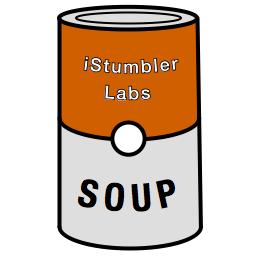

# Soup

An object oriented persistance framework modeled on the Apple Newton API.

## Contents

- <a href="#history">History</a>
- <a href="#whyyyy">Why Soup?</a>
- <a href="#protocols">Protocols</a>
- <a href="#stock">Stock</a>
- <a href="#flavors">Flavors</a>
- <a href="#examples">Examples</a>
- <a href="#license">MIT License</a>

## Newton Soup History

<blockquote>
Unlike traditional operating systems such as the MacOS and Windows NT there is
no file system and therefore no files in the Newton Operating Sytystem. Data is
instead stored in opaque collections like a database in entities known as soups.

Each entry in a soup can be likened to a record in a database and each data member
in an entry (known as a slot) can be likened to a field in a database. Unlike 
database records entries in a soup do not all have to have the same slots. 

To retrieve data entries from the soups you don't access them directly but rather
send queries to the soups which return cursor objects. You then use the cursor 
object to get copies of individual entries in the soup. You can then do whatever 
you want with the copies. The original entries in the soups are not modified unless 
you overwrite them with your changed copy.

The actual soups themselves are held on the Newton in stores. Every Newton device 
has at least one store (the internal store) but they can also have other external 
stores on PCMCIA cards. On a Newton MessagePad 130 there can be one external store 
as there is one PCMCIA slot. Other devices such as the MessagePad 2000 which has 
two PCMCIA slots can have more external stores.

So that you don't have to worry about which store your soup is on you can use a
type of soup known as a union soup in your application. This is a system maintained
virtual soup that is made up of all entries from a particular named soup no matter
where the entries are physically stored. 

For Example - if you have two soups named "Match Results" (one on the internal store 
and one on an external store) to hold results of football matches you can treat them 
as one big soup containing all the entries by using a union soup. Union soups take 
into account any choices you make for default storage location and add new entries to 
a union soup in the member soup which resides on your default store.

<a href="https://web.archive.org/web/20060210184323/http://www.canicula.com/newton/prog/soups.htm">Ian Robinson</a>
</blockquote>

<a href="http://en.m.wikipedia.org/wiki/Soup_(Apple_Newton)">Soup (Wikipedia)</a>

## Why Soup Now?

Soup was designed for dealing with storage on a mobile device where storage is transient.  This model is useful
for modern mobile devcies, particlary when they move between offline and connected states due to network 
availability. While most database focus on large data set performance or suitabiilty for high demand online 
production loads, few are optimized for the mobile use case, and fewer take the realaties of modern 
networking into account.

Soup brings back the simplicity and clarity of the Newton Soup API, adds modern conveniances  

### Simplicity of Design

Soups clear, simple design makes it easy to understand and to quickly intergrate int apps.

### Optimized for Presentaion

Soup has features which make it a pleasure to work with when building User interfaces

### Connected and Disconnected

The ability to build union soups and for entreis to be adoped from one soup to another allows for the flexability to
have local, online, and peer soups which are merged into a single data source for an applicaiton to present to the user.

## Soup Protocols

The Soup framework consists of the following protocols:

- <a href="Protocols/ILSoup.h">ILSoup</a> — ILSoup is the peer of the newtSoup proto
    - ILSoupDelegate — recieves messages when the soup performs operations or encouters errors
- <a href="Protocols/ILSoup.h">ILSoupEntry</a> — basic data storage unit in a soup
    - ILMutableSoupEntry — allows for mutation of elements
- <a href="Protocols/ILSoup.h">ILSoupIndex</a> — fast access to soup entries by property index
    - ILSoupCursor — index operations return cursors, which contain a list of entries
    - ILSoupTextIndex — index which can be queried for text
    - ILSoupDateIndex — index which can be queried for dates and ranges
    - ILSoupNumberIndex — index which can be queried for numbers and ranges
- <a href="Protocols/ILSoup.h">ILSoupSequence</a> — fast access to time sequence datat for numeric properties of entries
    - ILSoupSequceSource — Impedence match with SparkKit

## Soup Stock

Stock in-memory implemenatilns of the Soup Protocols

- <a href="Stock/ILSoupStock.h">ILSoupStock</a> <a href="Stock/ILSoupStock.m">[.m]</a>
- <a href="Stock/ILStockEntry.h">ILStockEntry</a> <a href="Stock/ILStockEntry.m">[.m]</a>
    - ILMutableStockEntry
- <a href="Stock/ILStockIndex.h">ILStockIndex </a> <a href="Stock/ILStockIndex.m">[.m]</a>
    - ILStockCursor
    - ILStockTextIndex
    - ILStockDateIndex
    - ILStockNumberIndex
- <a href="Stock/ILStockSequence.h">ILStockSequence </a> <a href="Stock/ILStockSequence.m">[.m]</a>
    - ILStockSequenceSource 

## Soup Flavors

The Soup framework includes a few pre-made flavors which you may find useful in your applications

- <a href="Flavors/ILFileSoup.h">ILFileSoup</a> — file-system based soup, entries are written to files
- <a href="Flavors/ILMemorySoup.h">ILMemorySoup</a> — in-memory soup made with Stock - 
- <a href="Flavors/ILQueuedSoup.h">ILQueuedSoup</a> — performs all queue and delegate operations on serial background queues 
- <a href="Flavors/ILSynchedSoup.h">ILSynchedSoup</a> — synchronized access to a soup, so that it can safely be mutated across multiple threads
- <a href="Flavors/ILUnionSoup.h">ILUnionSoup</a> — Combines several soups into a single virutal store
    - ILUnionSoupDelegate — Delegate messages relating to the soup

## Example: Address Book

    // define some keys for our address book
    static NSString* const ILName = @"name";
    static NSString* const ILEmail = @"email";
    static NSString* const ILNotes = @"notes";

    // create a stock memory soup
    ILMemorySoup* memory = [ILMemorySoup makeSoup:@"Address Book"];

    // prep the soup with some default indexes
    memory.soupDescription = @"Address Book Example Soup";
    [memory createIndex:ILSoupEntryAncestorKey];
    [memory createDateIndex:ILSoupEntryCreationDate];
    [memory createDateIndex:ILSoupEntryMutationDate];
    [memory createTextIndex:ILName];
    [memory createTextIndex:ILEmail];
    [memory createTextIndex:ILNotes];
    
    // add some entries to the union
    [memory addEntry:[[memory createBlankEntry] mutatedEntry:@{
        ILName:  @"John Doe",
        ILEmail: @"j.doe@example.com"
    }]];

    [memory addEntry:[[memory createBlankEntry] mutatedEntry:@{
        ILName:  @"Jane Doe",
        ILEmail: @"jane.d@example.com"
    }]];

    // print out all entries
    NSLog(@"%@", memory);
    [memory setupCursor];
    id<ILSoupEntry> entry = nil;
    while ((entry = [[memory getCursor] nextEntry])) {
        NSLog(@"entry: %@", entry);
    }
    
    // search for does
    id<ILSoupCursor> does = [[memory queryTextIndex:ILName] entriesWithStringValueMatching:@".* Doe"];
    while ((entry = [does nextEntry])) {
        NSLog(@"doe %lu: %@", does.index, entry);
    }

<a href="Examples/addresses/main.m">Example Code</a>

## License

    The MIT License (MIT)

    Copyright (c) 2018 Alf Watt

    Permission is hereby granted, free of charge, to any person obtaining a copy
    of this software and associated documentation files (the "Software"), to deal
    in the Software without restriction, including without limitation the rights
    to use, copy, modify, merge, publish, distribute, sublicense, and/or sell
    copies of the Software, and to permit persons to whom the Software is
    furnished to do so, subject to the following conditions:

    The above copyright notice and this permission notice shall be included in all
    copies or substantial portions of the Software.

    THE SOFTWARE IS PROVIDED "AS IS", WITHOUT WARRANTY OF ANY KIND, EXPRESS OR
    IMPLIED, INCLUDING BUT NOT LIMITED TO THE WARRANTIES OF MERCHANTABILITY,
    FITNESS FOR A PARTICULAR PURPOSE AND NONINFRINGEMENT. IN NO EVENT SHALL THE
    AUTHORS OR COPYRIGHT HOLDERS BE LIABLE FOR ANY CLAIM, DAMAGES OR OTHER
    LIABILITY, WHETHER IN AN ACTION OF CONTRACT, TORT OR OTHERWISE, ARISING FROM,
    OUT OF OR IN CONNECTION WITH THE SOFTWARE OR THE USE OR OTHER DEALINGS IN THE
    SOFTWARE.

